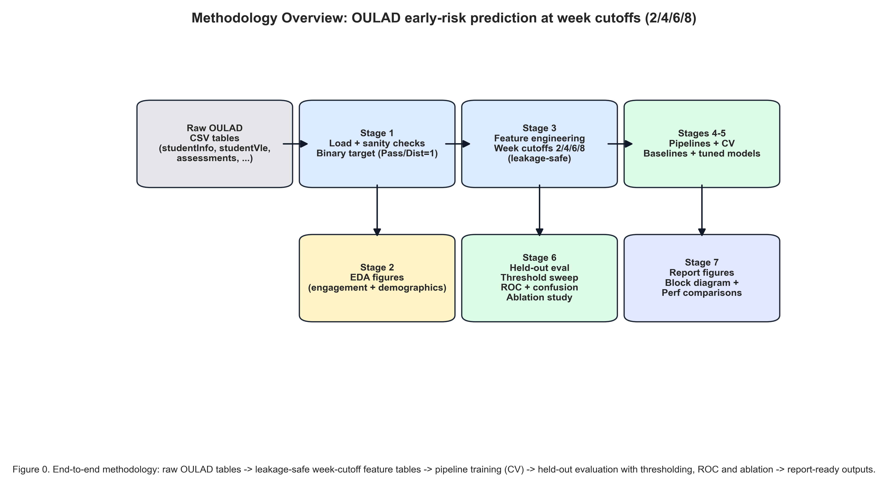

# Early Student At-Risk Prediction Pipeline (OULAD)
>
> **ELEN4025 — Machine Learning Group Project**
> An end-to-end, production-grade predictive pipeline using the Open University Learning Analytics Dataset (OULAD) to identify at-risk students through real-time engagement behavioural analytics.

---

## Project Overview & Objective

This repository contains a complete, robust Machine Learning pipeline that implements an Early Warning System (EWS) in higher education. Leveraging the rich time-series and demographic variables in the Open University Learning Analytics Dataset (OULAD), the pipeline predicts whether a student is at risk of an Unfavourable Outcome (defined as withdrawing from the course or failing) before crucial checkpoints in the semester.

Rather than predicting outcomes retrospectively (after a course has finished), this project is built around a dynamic time-series cutoff framework. The model evaluates student risk at four early milestones: Week 2, Week 4, Week 6, and Week 8. This allows educators to initiate targeted, timely academic interventions that can prevent student failure or dropout.

---

## Methodology & Pipeline Architecture

The end-to-end architecture is systematically structured across seven distinct stages. Below is a high-level representation of the process, which is programmatically illustrated in the generated methodology block diagram:



### Core Workflow Stages

1. **Stage 1 — Data Preprocessing & Cleaning**: Parsing relational tables, handling missing records programmatically, and mapping student outcomes to a binary target (`1` for Pass/Distinction, `0` for Fail/Withdrawn).
2. **Stage 2 — Exploratory Data Analysis (EDA)**: Visualizing demographic distributions, regional outcomes, click trajectories, and feature correlations.
3. **Stage 3 — Time-Cutoff Feature Engineering**: Constructing standalone weekly feature tables using strictly historical records relative to the cutoff (Weeks 2, 4, 6, 8) and auditing to ensure zero data leakage.
4. **Stage 4 — Baseline Pipeline Construction**: Constructing simple interpretable baselines (Dummy Classifier and Logistic Regression with $L_2$ regularization) with proper scaling and imputation.
5. **Stage 5 — Advanced Pipeline Construction & Tuning**: Designing and tuning complex non-linear models (Random Forest, MLP Neural Networks, Stochastic Gradient Descent SVMs, and XGBoost) using group-aware randomized search.
6. **Stage 6 — Out-of-Fold Evaluation, Sweeping & Ablation**: Evaluating trained models on a completely held-out test set, searching decision thresholds to optimize F1-score, and running systematic ablation studies.
7. **Stage 7 — Visualization & Manifest Compilation**: Automating report-ready performance plots, ROC curves, and saving a figure manifest.

---

## Machine Learning Engineering Best Practices

This pipeline serves as an educational benchmark for high-integrity machine learning design, incorporating the following essential engineering best practices:

### 1. Zero-Leakage Temporal Cutoffs

In time-series forecasting and real-time early warning systems, temporal data leakage is the most common reason models collapse in production.

* **The Good Practice**: The feature extraction logic strictly limits data aggregation to $\text{date} \le 7 \times W$ (for weeks $W \in \{2, 4, 6, 8\}$).
* **The Audit**: We implement an automated validation tool (`audit_no_leakage`) which scans the weekly tables and throws a fatal assertion if any posterior dates, future assessment grades, or posterior interaction log data are detected in training features.

### 2. Identity-Aware Group Validation (`StratifiedGroupKFold`)

In the OULAD dataset, students frequently register for multiple modules or course presentations.

* **The Risk**: If we use standard random K-Fold cross-validation, records belonging to the same student could be split across the training and validation sets. The model could easily memorize student-specific identifiers or unobserved traits, yielding highly overoptimistic validation scores that fail to generalize to new cohorts.
* **The Solution**: We enforce `StratifiedGroupKFold` cross-validation grouped by `id_student`. This guarantees that all registration records for any individual student are kept strictly within the same fold (100% in train, or 100% in validation), reflecting a true production deployment on unseen incoming students.

### 3. Pipeline-Level Preprocessing Encapsulation

* **The Risk**: Imputing missing values or calculating standard scaling statistics globally (before splitting data into training and validation sets) bleeds validation set statistical profiles into training, causing data leakage.
* **The Solution**: We encapsulate all transformers—such as missing value imputation (`SimpleImputer`), nominal categorical variables encoding (`OneHotEncoder`), and numerical feature normalization (`StandardScaler`)—within a scikit-learn `Pipeline`. All parameter fitting occurs strictly on the training fold, and the validation or test fold is only transformed.

### 4. Dynamic Threshold Sweeping for Asymmetric Costs

In an educational retention framework, the cost of a False Negative (failing to support an at-risk student who subsequently fails/withdraws) is extremely high, while the cost of a False Positive (wrongly sending a supportive academic nudge to a student who passes anyway) is negligible.

* **The Solution**: Rather than utilizing the generic default classification threshold of `0.5`, our pipeline sweeps decision boundaries from `0.05` to `0.95`. We identify the threshold that maximizes the F1-Score on the validation set and project this optimal boundary onto the held-out test split for final evaluation, maximizing the intervention's utility.

### 5. Rigorous Feature Ablation Studies

* **The Principle**: Complexity must be earned. A model that relies on 50 features is harder to maintain and deploy than a model relying on 10.
* **The Practice**: Our ablation study systematically drops broad categories of features (demographics, assessments, or virtual learning activity clicks) and quantifies the exact drop in F1-score. This isolates the value-add of each feature tier, helping justify data-collection overhead.

---

## Performance & Key Results

The following table summarizes the performance of the best selected pipeline per week cutoff evaluated on a completely held-out test set (20% split, unseen student groups):

| Week Cutoff | Deployed Model | Chosen Threshold | Test Accuracy | Test Precision | Test Recall | Test F1-Score | Test ROC-AUC |
|:---:|:---|:---:|:---:|:---:|:---:|:---:|:---:|
| **Week 2** | MLP Neural Network | `0.40` | `69.67%` | `64.06%` | `83.81%` | **`0.7261`** | **`0.7871`** |
| **Week 4** | Random Forest | `0.35` | `72.99%` | `65.56%` | `92.03%` | **`0.7657`** | **`0.8317`** |
| **Week 6** | MLP Neural Network | `0.35` | `75.25%` | `68.07%` | `91.17%` | **`0.7795`** | **`0.8503`** |
| **Week 8** | XGBoost Classifier | `0.35` | `79.41%` | `73.14%` | `90.20%` | **`0.8078`** | **`0.8773`** |

### Key Result Observations

1. **Dynamic Performance Escalation**: As the semester progresses from Week 2 to Week 8, the model's predictive power increases significantly (ROC-AUC climbs from `0.7871` to `0.8773`, and F1-Score rises from `0.7261` to `0.8078`). This is expected as more behavioural clicks and assessment scores are logged.
2. **High Early Warning Signal**: Even at Week 2 (only 14 days into the semester), the MLP pipeline achieves an AUC of `0.7871` and a recall of `83.81%`. This indicates that early online course-engagement activity represents a highly active predictor of student success, allowing for extremely early interventions.
3. **Equitable Ablation Insights**: The ablation study reveals that removing Demographics results in minor performance drops (e.g., F1 change of only `-0.0153` in Week 2, and down to `-0.0068` in Week 8). This is a crucial finding: active behavioral engagement (clicks) and academic progress (assessments) are the dominant drivers of success, rather than static demographic background or socio-economic indicators. This enables schools to build highly ethical early-warning systems that trigger support based on student effort and behavior rather than demographic profiling.

---

## Repository Structure

```directory
bennyboysmlproject6767/
├── .gitignore
├── README.md                 # Project landing page (this document)
├── datasets.sh               # Bash script to download/unzip OULAD raw data
├── project.ipynb             # Full Notebook: Stages 1 through 7 (Main Pipeline)
├── stage1.ipynb              # Baseline preprocessing & target mapping notebook
├── data/
│   ├── raw/                  # Raw OULAD CSV tables (loaded from zip)
│   └── processed/            # Intermediate CSVs and final experiment results
└── figures/                  # Report-ready publication plots
    ├── README.md
    ├── REPORT_FIGURES.md     # Auto-generated report figures list
    ├── diagram/              # Pipeline methodology block diagrams (PDF/PNG)
    ├── eda/                  # Exploratory Data Analysis charts (Fig 1-8)
    └── performance/          # Week-by-week performance and ROC overlays (Fig 9-16)
```

---

## Replication & Running Guide

To replicate the training pipeline, generate figures, and recreate results tables, follow these simple steps:

### 1. Clone & Set Up the Environment

First, ensure you have Python 3.8+ installed. Set up a virtual environment and install the required machine learning dependencies:

```bash
# Create and activate virtual environment
python -m venv .venv
source .venv/bin/activate  # On Windows, use `.venv\Scripts\activate`

# Upgrade pip and install core dependencies
pip install --upgrade pip
pip install pandas numpy scikit-learn matplotlib seaborn xgboost ipykernel
```

### 2. Download the OULAD Dataset

Run the included helper script to bootstrap the data directory and pull the OULAD zip archive.

```bash
# Make script executable and run it
chmod +x datasets.sh
./datasets.sh
```

*(Note: If curl encounters an issue, manually download the OULAD dataset zip from Kaggle [here](https://www.kaggle.com/datasets/anlgrbz/student-demographics-online-education-dataoulad) and extract all tables into `./data/raw/`).*

### 3. Run the Pipeline Notebook

Open the notebook in your IDE (VS Code, JupyterLab, etc.) and run all cells sequentially:

```bash
# Launch jupyter lab
jupyter lab project.ipynb
```

Running the notebook will:
* Parse raw files and clean duplicates/missing records.
* Run the full Exploratory Data Analysis.
* Aggregated features up to Weeks 2, 4, 6, 8.
* Tune the baseline and advanced classifiers.
* Run out-of-fold threshold sweeping and ablation studies.
* Output all performance charts directly into `figures/`.

---
